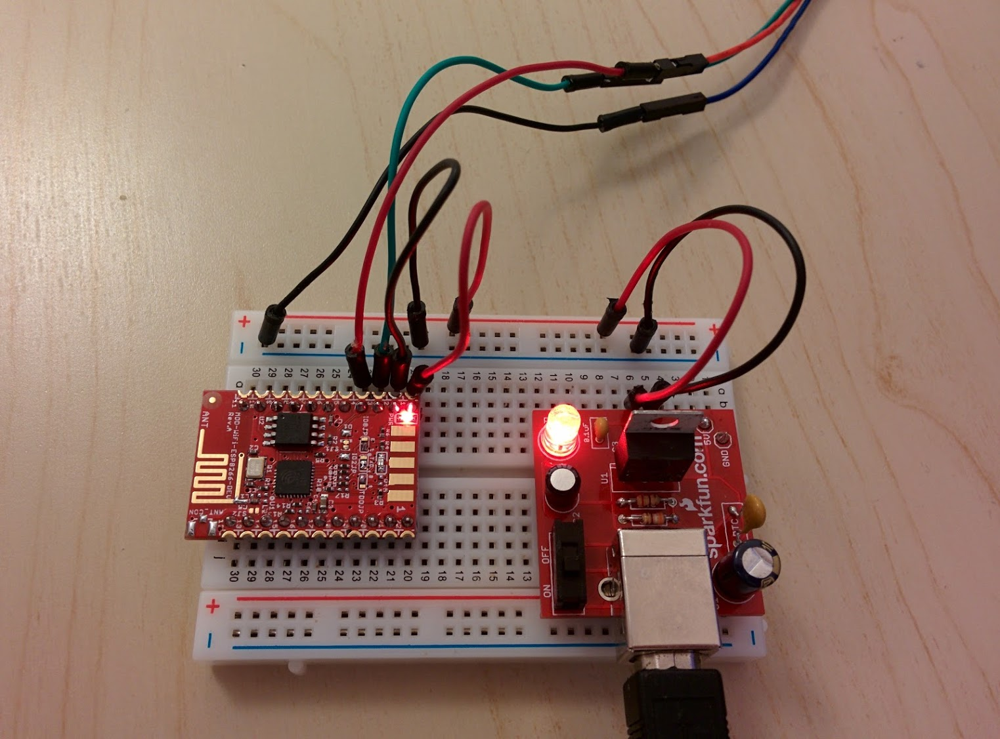
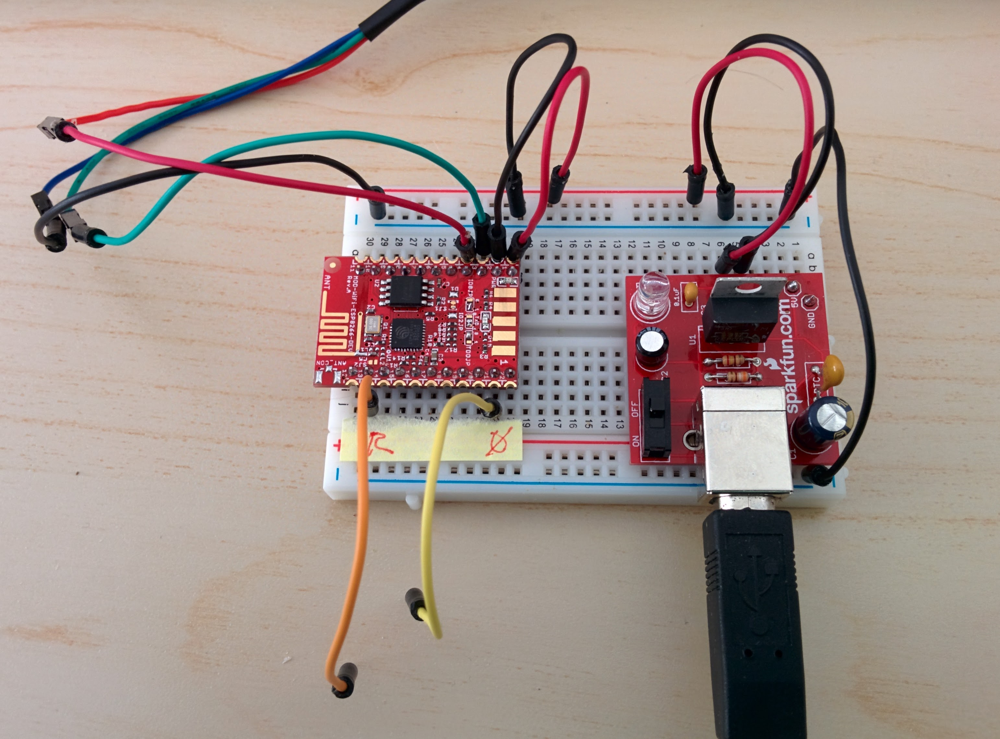

The [Olimex ESP8266](https://www.olimex.com/Products/IoT/MOD-WIFI-ESP8266-DEV/open-source-hardware) is a nice board that's very easy to wire-up and use.

Easy once you know how, that is. With a little extra effort Olimex could have documented the initial setup on their product page.

However, currently the most useful document there is the [schematic](https://github.com/OLIMEX/ESP8266/blob/master/HARDWARE/MOD-WIFI-ESP8266-DEV/MOD-WiFi-ESP8266-DEV%20revision%20B1/MOD-WiFi-ESP8266-DEV_Rev_B1.pdf) for the board.

Pinout
------

From the schematic the board pad to pin assignments are as follows:

PAD | PIN
---:| ---
1   | 3.3V
2   | GND
3   | GPIO1
4   | GPIO3
5   | SD_CLK
6   | SD_D2
7   | SD_D1
8   | SD_CMD
9   | SD_D0
10  | SD_D3
11  | GPIO5
12  | ADC
13  | RSTB
14  | CHIP_EN
15  | GPIO16
16  | GPIO12
17  | GPIO14
18  | GPIO13
19  | GPIO15
20  | GPIO2
21  | GPIO0
22  | GPIO4

With the board oriented so the antennae is at the bottom edge, pins 1 to 11 run from the upper left to lower left and then pins 12 to 22 run from the the lower right to the upper right. The five large pads, on the opposite edge to the antenna, are numbered 1 to 5 going right to left.

It's important to be clear about the distinction between Olimex board pad numbers and the pin numbers of the ESP8266 chip. In the schematic linked to above you can see two things:

* The chip at the center of the schematic with pin numbers, from 1 to 32, running anti-clockwise around the outside of the chip. For each pin _number_ there is a corresponding pin _name_ shown within the outline of the chip, e.g. pin 24 is `GPIO5`.
* To the right there is the table that's reproduced above showing the mapping from chip pin _names_ to the board's pad _numbers_, e.g. `GPIO5` is broken out on pad 11 of the board.

Serial cable
------------

The ESP8266 is 3.3V - and this is the voltage supported by the [Olimex USB serial cable F](https://www.olimex.com/Products/Components/Cables/USB-Serial-Cable/USB-SERIAL-F/).

Sparkfun have a similar cable - the [USB to TTL serial cable](https://www.sparkfun.com/products/12977) (note that the VCC pin here, that the Olimex cable does not have, is not of much use as it, unlike the other pins, is 5V). They also have a surprisingly large range of variants on this theme - their [3.3V FTDI cable](https://www.sparkfun.com/products/9717) (that provides additional RTS and CTS pins), much the same thing as an [3.3V FTDI basic breakout](https://www.sparkfun.com/products/9873) (but with DTR rather than RTS), along with more sophisticated [FT231X](https://www.sparkfun.com/products/11736) and [FT232RL](https://www.sparkfun.com/products/12731) breakouts.

udev rules for `/etc/udev/rules.d/50-serial-ports.rules`

    # Prolific PL2303 serial port (Olimex serial cable F).
    SUBSYSTEM=="tty", ATTRS{idVendor}=="067b", ATTRS{idProduct}=="2303", \
        SYMLINK+="pl2303-serial-port", MODE="0666"

    # Prolific PL2303 serial port (Olimex serial cable F).
    ATTRS{idVendor}=="067b", ATTRS{idProduct}=="2303", ENV{MTP_NO_PROBE}="1"

Note: Adafruit have level shifting on the UART and reset pins of their [HUZZAH ESP8266 breakout](http://www.adafruit.com/product/2471) so you can use a 5V FTDI cable with it.

Wiring up the Olimex MOD-WIFI-ESP8266-DEV
-----------------------------------------

From the schematic linked to above you can see that:

* pad 3 is TX
* pad 4 is RX

The board isn't powered through the serial cable, so we need a separate 3.3V power supply.

Again from the schematic:

* pad 1 is 3.3V.
* pad 2 in GND.

So you end up using two USB ports - one to provide power to something like the [SparkFun Breadboard Power Supply USB](https://www.sparkfun.com/products/8376) and the other for the Olimex serial cable.

Breadboard wiring:

* 3.3V/GND pair of the power supply to the plus and minus rails of the breadboard.
* Plus to pad 1 of the Olimex board and minus to pad 2.
* Minus to the blue wire of the serial cable.
* Pad 3 (TX) to the green wire of the serial cable and pad 4 (RX) to the red wire.

Once connected blindingly bright red LEDs light up on both the SparkFun power supply and the Olimex board.

In contrast to the bright red power LED there is a tiny green LED connected to the TX line that blinks almost unnoticeably e.g. when uploading to the board.

Board components
----------------

Other than the power and TX LEDs just mentioned, there's not much else to the board:

* A Winbond W25Q16BVSSIG 16MBit serial flash memory chip.
* An on-board antenna (with an SMT jumper allowing you to divert to pads for a U.FL connector).
* The pull-up and pull-down resistors needed on various pins for normal operation.

In particular GPIO0 and GPIO2 are connected to pull-up resistors and GPIO15 (also called MTDO) is connected to a pull-down resistor, but for each there is an SMT jumper that allows the the pull-type, i.e. up or down, to be reversed.

The jumper can be changed in order to change the mode in which the board starts up, for more details see the [Olimex jumper reference](https://www.olimex.com/Products/IoT/MOD-WIFI-ESP8266-DEV/resources/MOD-WIFI-ESP8266-DEV_jumper_reference.pdf) for the board.

Reset
-----

Pad 13 is connected to EXT_RSTB (and an external pull-up resistor) and you can reset the board by temporarily connecting it to ground.

See the Olimex schematic and the [pin definitions page](https://github.com/esp8266/esp8266-wiki/wiki/Pin-definition) of the ESP8266 wiki.

Arduino IDE
-----------

Setting up the Arduino IDE 1.6.4 or later for the ESP8266 is trivial for the Olimex board, there is specific support for it in the standard package found at:

* https://github.com/esp8266/Arduino

Just install the board manager as [described there](https://arduino-esp8266.readthedocs.io/en/2.7.4_a/installing.html#boards-manager).

Then under Tools / Board select the Olimex board from the ESP8266 Modules section.

Under Tools / CPU Frequency and Upload Speed should default to 80MHz and 115200 respectively, which are fine.

A port is not automatically selected - you need to do this.

For some reason my Olimex board ends up with a `/dev` name of `ttyUSB0` rather than the more normal `ttyACM0` but this seem to be fine. If you use the udev rules above it should have a consistent name, i.e. `/dev/pl2303-serial-port`.

The Tools / Programmer selection is irrelevant.

Bootloader mode
---------------

Looking on the web, there seems to be quite a lot of differences/confusion about putting the ESP8266 into bootloader mode.

Some of this is quite simple - there are different essentially equally valid ways of resetting the board, some toggle CHIP_EN (pin 7) while most toggle EXT_RSTB (pin 32).

Also different names are used for the same pin:

* CHIP_EN is also called CH_PD.
* GPIO15 is also called MT_DO or MTDO.
* EXT_RSTB is also called RTS, RST or RSTB.

Note: RTS (ready-to-send) is used by some as a name for the reset pin as wiring the reset pin to the RTS pin of a serial cable is a way of getting the board to automatically reset when uploading a sketch.

In some desciptions, people mistakenly wire-up various external pull-up and pull-down resistors, these are needed but are generally already provided by the various boards.

The clearest description of what's required is seen here:

* https://arduino-esp8266.readthedocs.io/en/latest/boards.html#minimal-hardware-setup-for-bootloading-and-usage

For the remainder of this section, I'll use the pin names used there. If you've already got the Olimex board connected to power and to a serial cable then nearly all of the required pins are already wired up correctly:

* VCC (pad 1) and GND (pad 2) to power.
* TX (pad 3) and RX (pad 4) to the serial cable.
* CH_PD (pad 14) and GPIO15 (pad 19) are already wired by the board to a pull-up and a pull-down resistor respectively.

This leaves just GPIO0 (pad 21) and Reset (pad 13) that are left to be managed manually.

If you had a serial cable with RTS and DTR then even these pins can be managed automatically. However the Olimex serial cable has neither.

Both GPIO0 and Reset have pull-up resistors provided by the Olimex board, so the pads for both can simply be directly connected and disconnected from GND to toggle them.

To get the board into boatloaded mode the GPIO0 pin must be low when the chip starts up. So all that's required is:

1. Connect GPIO0 (pad 21) to GND.
2. Connect Reset (pad 13) to GND, then disconnect it.
3. Disconnect GPIO0 (pad 21) from GND.

The ESP8266 is now in bootloarder mode and you can upload a sketch from the Arduino IDE.

Once you upload a sketch it will start running immediately, i.e. no separate step is required to exit bootloader mode.

You need to go through these steps everytime you want to upload a sketch.

Reset and GPIO with dangling jumper wires for connecting them to GND, remember to also connect the GND rail to the rail on the other side:  

This page shows wiring RSTB and GPIO0 to RTS and DTR on a serial cable:

* http://digitalhacksblog.blogspot.ch/2015/01/olimex-mod-wifi-esp8266-devhardware.html

Note: the author of this page mistakenly describes GPIO0 as MTDO where all other pages that use this name generally make clear this means GPIO15.

This page and the [Serial Monitor section](https://learn.sparkfun.com/tutorials/esp8266-thing-hookup-guide/all#serial-dtr) of Sparkfun's hookup guide for their ESP8266 board also describe a downside to hooking up RSTB and GPIO0 in this way - opening a serial monitor connection to the board causes it to reset.

Connecting to a LiPo battery
----------------------------

Two options for connecting the Olimex board to a LiPo battery are:

* the [LiPower board](https://www.sparkfun.com/products/10255) from SparkFun.
* the [3.3V step-up/step-down voltage regulator board](https://www.pololu.com/product/2122) from Pololu.
